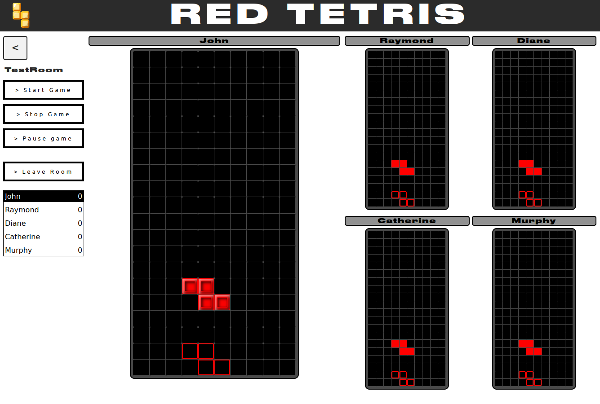

  

# RedTetris

## Introduction
This subject aims to create a web multiplayer Tetris game using Javascript, Vue.js, Node.js and socket.io.

42 subject: [https://cdn.intra.42.fr/pdf/pdf/84885/en.subject.pdf](https://cdn.intra.42.fr/pdf/pdf/130200/en.subject.pdf)

The subject focuses on implementing an asyncronous multiplayer game from the front to the back and managing all the communications between users and server.

## The Game
Tetris is a puzzle game (see Wikipedia), whose subject is to contain falling pieces as
long as possible in a Playground. The game is over when the field no longer offers enough
room for a new piece to fall. When one or more lines of land are complete, they disappear,
allowing to postpone the expiry of the game

Each player has his own playing field, all players undergo the same series of pieces.
As soon as a player destroys lines on his ground, the opposing players receive n - 1 lines
in penalty, then indestructible, which fit at the bottom of their playground.
A terrain consists of 10 columns and 20 lines. Each player can graphically observe the
list of his opponents (name) and the specter of their land. For each column, a spectrum
indicates the first line occupied by a piece without providing any details about occupation
of the following lines. As soon as the terrain is updated, all opponents must visualize the
evolution of their spectrum.

The last player of the game is the winner.
The game can be played in solo.

### Moving the pieces
Moving the different tetrominoes uses the standard Tetris controls:
  - 'LEFT'/'RIGHT' to move the piece laterally.
  - 'UP' to rotate the current piece clockwise.
  - 'DOWN' to move the piece down one row on the grid.
  - 'SPACE' to instantly place the piece at its highlighted position at the bottom of the grid.

This Tetris game uses '[The Super Rotation System](https://tetris.fandom.com/wiki/SRS)'', also known as 'SRS' and 'Standard Rotation System' with corresponding Wall kicks techniques.

## Run program
The program run using pnpm:
`pnpm install`
`pnpm build`
`pnpm back`

After that, you can go at 'localhost:3000'.
By default, you can 'create' a new user by simply opening a new tab at localhost.

If you want to deploy it on a local network, for example, you have to replace 'localhost' with your current local IP address.

## Screenshots

Main Lobby page:

Game page:

